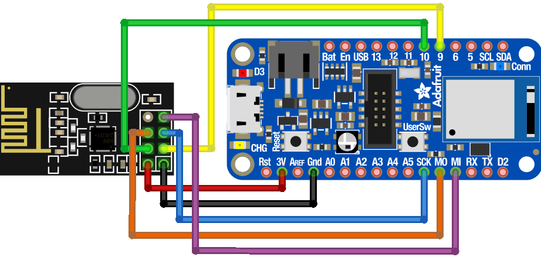

# A Methodology for Low-Level 2.4 GHz Protocol Analysis using the nRF52840

This repository contains the firmware and report for my final project in  
T-742-CSDA – Computer Security: Defence Against the Dark Arts.

The goal is to develope a standalone device capable of sniffing, analyzing, and spoofing the proprietary 2.4 GHz protocols used by modern wireless mice.

## Repository structure

- `nrf52840_sniffer/`  
  PlatformIO project for the Adafruit Feather nRF52840 sniffer and replay tool.

- `metro-echo-target/`  
  PlatformIO project for the Metro M4 + nRF24L01+ "echo target".

Each subfolder has its own `platformio.ini` and its own README with more details.

## Hardware overview

Feather nRF52840 sniffer with external nRF24L01+ module:

Metro M4 echo target with nRF24L01+:

## Opening in VSCode / PlatformIO

These are two independent PlatformIO projects.

To work on the sniffer firmware:

1. In VSCode, choose "File → Open Folder…".
2. Select the `nrf52840_sniffer` folder (not the repo root).

To work on the Metro echo target:

1. Open a new VSCode window.
2. Choose "File → Open Folder…".
3. Select the `metro-echo-target` folder.

Opening the top-level `nRF52840_Mousejacker` folder directly will not give you a
single combined PlatformIO project, because each subfolder is its own project.

## Building from the command line

You can also build and upload using the PlatformIO CLI.

### nRF52840 sniffer

    cd nrf52840_sniffer
    pio run            # build
    pio run -t upload  # upload to Feather nRF52840

### Metro echo target

    cd metro-echo-target
    pio run            # build
    pio run -t upload  # upload to Metro M4

For firmware variants (with/without nRF24, one vs two radios), see the README in
each subfolder.

### Report
will be linked here when final submission has been made
