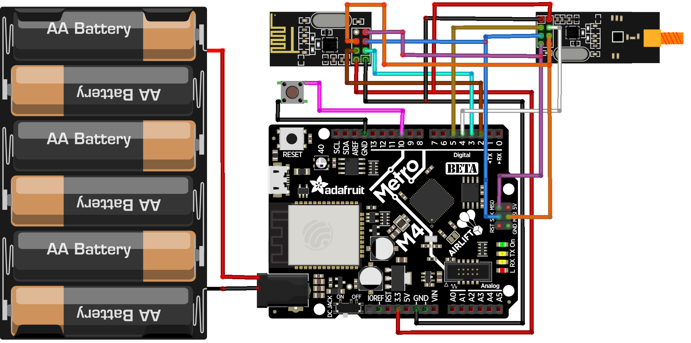

# Metro M4 nRF24L01 Echo Target

This is the PlatformIO project for the Adafruit Metro M4 plus nRF24L01+ module
used as an independent "echo target" to validate the sniffer’s TX/RX behaviour
and replay capability.

The Metro firmware:

- Periodically transmits a known 32-byte packet
  (e.g. `METRO_ECHO_TEST_01`).
- Listens for the same packet.
- Indicates successful reception by switching the color of the neopixel.

## Hardware overview

Metro M4 echo target with nRF24L01+:

## Boards / environment

- Board: `adafruit_metro_m4_airliftlite`
- Framework: Arduino

## Firmware variants

There are two variants of the Metro firmware:

- `src/main_two_radios.cpp`  
  Default build. Version used for the tests described in the report (e.g. a
  two-radio configuration, if applicable in your code).

- `extras/main_one_radio.cpp`  
  Alternate version that uses only one radio (simpler hardware setup).

PlatformIO only compiles files in `src/`.

### Switching to the one-radio version

1. Move the current default firmware out of `src/`:

       mv src/main_two_radios.cpp extras/main_two_radios.cpp

2. Move the one-radio variant into `src/`:

       mv extras/main_one_radio.cpp src/main_one_radio.cpp

3. Build and upload:

       pio run
       pio run -t upload

## Building and uploading

From this folder (`metro-echo-target`):

    pio run            # build
    pio run -t upload  # flash to the Metro M4

