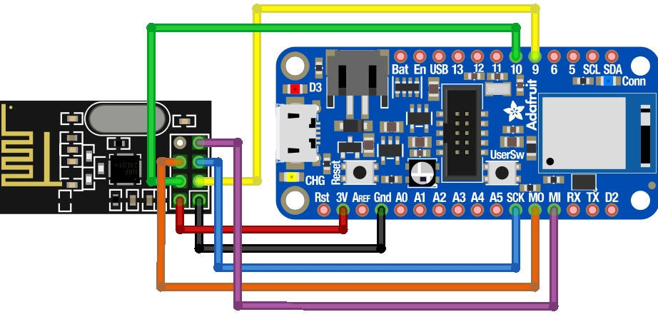

# nRF52840 Sniffer and Replay Tool

This is the PlatformIO project for the Adafruit Feather nRF52840 Express used
as a low-level 2.4 GHz sniffer, packet analyzer, and replay device.

It implements:

- RSSI-based channel sweeping to lock onto active channels.
- A queue-based capture/processing pipeline to reduce packet loss during heavy serial output.
- Interactive serial UI for on-the-fly tuning of nRF52 RADIO registers.
- Smart active address discovery using raw capture, bit shifting, sliding-window parsing, and software CRC matching.
- Preset-based multi-pipe scanning for promiscuous-style capture experiments.
- Recording and replay of captured packets.

## Hardware overview

Feather nRF52840 sniffer with external nRF24L01+ module:

## Boards / environment

- Board: `adafruit_feather_nrf52840`
- Framework: Arduino (Adafruit nRF52 core)

## Firmware variants

There are two variants of the Feather firmware:

- `src/main_sniffer_with_nrf24.cpp`  
  Default build. Full-featured sniffer firmware with an attached external
  nRF24L01+ module used as a local target transmitter for validation and
  loopback-style testing. This version includes smart address discovery,
  packet queueing, replay support, and expanded interactive radio controls.

- `extras/main_sniffer_standalone.cpp`  
  Alternate version that runs the sniffer without any external nRF24 module
  attached. Use this if only the Feather nRF52840 itself is present.

PlatformIO only compiles source files in `src/`, so whichever variant lives in
`src/` will be the one that builds.

### Switching to the standalone sniffer (no nRF24 attached)

1. Move the current default firmware out of `src/`:

       mv src/main_sniffer_with_nrf24.cpp extras/main_sniffer_with_nrf24.cpp

2. Move the standalone variant into `src/`:

       mv extras/main_sniffer_standalone.cpp src/main_sniffer_standalone.cpp

3. Build and upload:

       pio run
       pio run -t upload

(You can also do these moves in the VSCode Explorer if you prefer GUI.)

## Building and uploading

From this folder (`nrf52840_sniffer`):

    pio run            # build
    pio run -t upload  # flash to the Feather nRF52840

## Serial interface (overview)

The firmware exposes an interactive interface over the USB serial port.
Typical usage is via:

    pio device monitor

at 250000 baud.

Key capabilities include:

- channel sweep and manual channel control
- live tuning of packet format fields (`BALEN`, `LFLEN`, `S1LEN`, `STATLEN`)
- CRC length/profile selection
- address preset cycling and pipe focusing
- smart address discovery
- packet recording and replay
- verbose vs clean payload output modes

### Common commands

General:
- `h` - show help
- `P` - print current configuration
- `S` - run a channel sweep and lock to the strongest active channel
- `T`, `[`, `]` - adjust RSSI print threshold
- `c`, `+`, `-` - set or step the current channel

Address / discovery:
- `M` - manually enter an address (`AA 12 34 ...`)
- `n` - cycle built-in address presets
- `A` - listen on all pipes (preset mode)
- `0`-`7` - focus on a specific pipe (preset mode)
- `X` - start smart active address discovery
- `Z` - clear the current manual address and return to the default `0xAA`

Radio format / decoding:
- `W` - toggle whitening
- `D` - toggle data rate (1 Mbps / 2 Mbps)
- `C` - cycle CRC length (off / 1 byte / 2 bytes)
- `V` - cycle CRC polynomial / init profiles
- `b`, `l`, `s`, `t`, `K` - adjust `PCNF0` / `PCNF1` packet format fields
- `L` - cycle preamble length mode
- `e` - toggle payload endianness
- `i` - toggle CRC address inclusion
- `p` - toggle header parsing
- `<`, `>` - bit-shift displayed payload left / right

Output / replay:
- `o` - toggle verbose vs clean payload-only output
- `R` - start / stop packet recording
- `f` - replay recorded packets
- `r` - reapply the radio with the current settings
